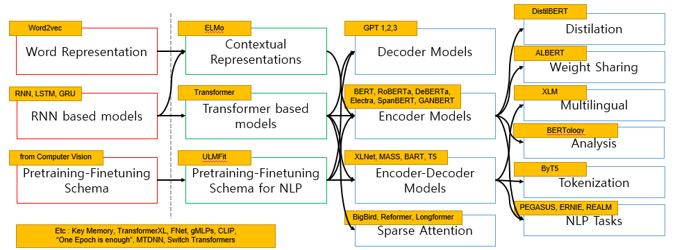

# Yonsei NLP Study Season 1
  
**[About Yonsei NLP Study]**  
Yonsei NLP Study is consisted of 4 Students who are very passionate in the field of Natural Language Processing!  
Every week, each student reads 4 papers, and each student gets to give a presentation on 1 paper.  
After the presentation, all the students discuss about that paper and share ideas.  
 
**[About Season 1]**  
Yonsei NLP Study Season 1 (2021.07.07 ~ 2021.08.25)  
Main Topic : Transformer based Language Models with Various Pretraining Methods  
During this period we have covered 37 papers in total!  
 
**[About this repository]**  
This repository contains presentation materials, links to presentation videos, and a summary of all the papers we have studied in Yonsei NLP Study Season1(2021.07.07~2021.08.25).  
 
## About the Members
* [Seungone Kim(김승원)](https://github.com/SeungoneKim) - Leader!
* [GUIJIN SON(손규진)](https://github.com/guijinSON)
* [Hyungjoo Chae(채형주)](https://github.com/kyle8581)
* [Sejune Joo(주세준)](https://github.com/joocjun)

## Link to Presentation(Youtube)
* [RoBERTa (Seungone Kim)](https://www.youtube.com/watch?v=_FUXSTK_Xqg)
* [PEGASUS (Seungone Kim)](https://www.youtube.com/watch?v=lc-o2_GTARY)
* [BIGBIRD (Seungone Kim)](https://www.youtube.com/watch?v=CWbrnkGC0c0)
* [Sparse Attention - Reformer & Longformer (Seungone Kim)](https://www.youtube.com/watch?v=gipCOCw3aqA)
* [gMLPs (Seungone Kim)](https://www.youtube.com/watch?v=dcolzDa5YUU)

## List of Papers we covered
The following are the list of 37 papers  
(Two more papers to be added)  

### Prerequisite Papers
* [Universal Language Model Fine-tuning for Text Classification](https://arxiv.org/abs/1801.06146)
* [Deep contextualized word representations](https://arxiv.org/abs/1802.05365)
* [Attention is All You Need](https://arxiv.org/abs/1706.03762)
* [BERT: Pre-training of Deep bidirectional Transformers for Language Understanding](https://arxiv.org/abs/1810.04805)

### Transformer based Language Models with Various Pretraining Methods
* [Improving Language Understanding by Generative Pre-Training](https://paperswithcode.com/method/gpt)
* [Language Models are Unsupervised Multitask Learners](https://paperswithcode.com/method/gpt-2/)
* [Language Models are Few-Shot Learners](https://paperswithcode.com/method/gpt-3)
* [XLNet: Generalized Autoregressive Pretraining for Language Understanding](https://arxiv.org/abs/1906.08237)
* [RoBERTa: A Robustly Optimized BERT Pretraining Approach](https://arxiv.org/abs/1907.11692)
* [Masked Sequence to Sequence Pre-training for Language Generation](https://arxiv.org/abs/1905.02450)
* [BART: Denoising Sequence-to-Sequence Pre-training for Natural Language Generation, Translation, and Comprehension](https://arxiv.org/abs/1910.13461)
* [Multi-Task Deep Neural Networks for Natural Language Understanding](https://arxiv.org/abs/1901.11504)
* [Exploring the Limits of Transfer Learning with a Unified Text-to-Text Transformer](https://arxiv.org/abs/1910.10683)
* [DeBERTa : Decoding-enhanced BERT with Disentangled Attention](https://arxiv.org/abs/2006.03654)
* [SpanBERT : Improving Pre-training by Representing and Predicting Spans](https://arxiv.org/abs/1907.10529)
* [ELECTRA : Pretraining Text Encoders as Discriminators Rather Than Generators](https://arxiv.org/abs/2003.10555)

### Sparse Attention Models & Approaches for Longer Sequences
* [Big Bird: Transformers for Longer Sequences](https://arxiv.org/abs/2007.14062)
* [Reformer : The Efficient Transformer](https://arxiv.org/abs/2001.04451)
* [Longformer : The Long-Document Transformer](https://arxiv.org/abs/2004.05150)
* [Transformer-XL : Attentive Language Models Beyond a Fixed-Length Context](https://arxiv.org/abs/1901.02860)

### Distilation / Weight Sharing 
* [DistilBERT, a distilled version of BERT: smaller, faster, cheaper and lighter](https://arxiv.org/abs/1910.01108)
* [ALBERT: A Lite BERT for Self-supervised Learning of Language Representations](https://arxiv.org/abs/2007.14062)

### MultiLingual / Analysis / Tokenization
* [Transformer-XL : Attentive Language Models Beyond a Fixed-Length Context](https://arxiv.org/abs/1901.02860)
* [A Primer in bertology : What we know about how bert works](https://arxiv.org/abs/2002.12327)
* [ByT5: Towards a token-free future with pre-trained byte-to-byte models](https://arxiv.org/abs/2105.13626)

### New model architecture / pretraining approaches for Natural Language Processing
* [Pay Attention to MLPs](https://arxiv.org/abs/2105.08050)
* [GAN-BERT : Generative Adversarial Learning for Robust Text Classification with a Bunch of Labeled Examples](https://aclanthology.org/2020.acl-main.191/)
* [Switch Transformers : Scaling to trillion parameter models with simple and efficient sparsity](https://arxiv.org/abs/2101.03961)
* [Large Product Key Memory for Pretrained Language Models](https://arxiv.org/abs/2010.03881)
* [Fnet : Mixing Tokens with Fourier Transforms](https://arxiv.org/abs/2105.03824)

### NLP Tasks : Summarization / QA
* [ERNIE : Enhanced Language Representations with Informative Entities](https://arxiv.org/abs/1905.07129)
* [REALM : Retrieval-Augmented Language Model Pre-training](https://arxiv.org/abs/2002.08909)
* [PEGASUS : Pre-training with extracted gap-sentences for Abstractive Summarization](https://arxiv.org/abs/1912.08777)

### Etc
* [One Epoch is All You Need](https://arxiv.org/abs/1906.06669)
* [CLIP : Connecting Text and Images](https://openai.com/blog/clip/)
